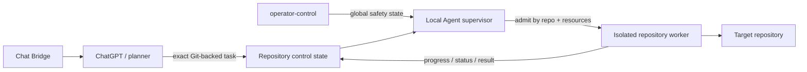

# Local Agent

[](https://github.com/MichalMatu/local-agent/actions/workflows/ci.yml)

**Deterministic, bounded local execution for AI-assisted software development.**

Local Agent separates planning from execution: an AI planner decides **what should change** and submits an exact task; Local Agent executes that task locally under explicit limits, preserves failure evidence and publishes machine-readable status and results describing **what actually happened**.

> [!IMPORTANT]
> The planner proposes work. The executor owns repository identity, admission, process lifecycle, time/memory bounds, recovery evidence and emergency controls.

**Release source of truth:** `agent_version.RELEASE_VERSION` plus the matching `vX.Y.Z` Git tag. Verify a running daemon against `.agent/status/daemon.json` rather than assuming the checkout version is live.

## Why Local Agent exists

AI coding workflows become much safer when the model is not also the authority for execution state.

Local Agent provides a narrow execution boundary with four priorities:

| Principle | What it means |
| --- | --- |
| **Deterministic** | Exact tasks, immutable digests and explicit terminal results. |
| **Bounded** | Command, no-output, whole-task and RSS watchdogs; bounded stdout retention. |
| **Recoverable** | Crash-safe checkpoints, durable result spooling and no silent task replay. |
| **Observable** | Git-backed status, runs, progress and failure evidence. |

It is execution infrastructure, not an LLM framework and not an autonomous source of project intent.

## Architecture at a glance



A ChatGPT conversation can be hard-bound to one canonical repository identity. The runtime independently validates the registry binding, control binding and task binding before work may be claimed.

## Core capabilities

- immutable task digests, durable claims and explicit terminal results;
- command, no-output, whole-task and RSS watchdogs;
- bounded stdout retention and process-group control;
- crash-safe checkpointing and durable result spooling;
- isolated per-repository control, work and checkpoint state;
- inherited repository and machine-resource leases that survive worker death through descendants;
- bounded parallel admission with explicit repository and external-resource isolation;
- Git-backed tasks, runs, results, status and control;
- transient Git-network retry with actionable terminal diagnostics;
- validated fast-forward self-update from a clean `main` checkout;
- repository-scoped task cancellation and persistent global emergency disable;
- hard Chat Bridge conversation-to-repository binding;
- generated, user-portable macOS `launchd` deployment.

## Production execution model

`main` is the runtime/release source. Candidate branches and detached worktrees are temporary validation infrastructure; production returns to `~/local-agent` on `main` after a validated release.

The recommended registered multi-repository supervisor is:

```bash
python agent_parallel.py --max-workers 2
```

`agent_multirepo.py` is the direct serial fallback with global concurrency exactly one. Serial and parallel supervisors share the same daemon lock and must never run simultaneously.

### Resource admission

Every task declares `resources` explicitly:

```json
{
  "resources": []
}
```

- `resources: []` — repository-local work with no exclusive external resource beyond the repository lease;
- `resources: ["board:growbox-s3"]` — serialize only work that needs the same concrete external resource;
- `resources: ["machine"]` — reserve the whole host for genuinely machine-exclusive work;
- `memory_limit_mb` is an independent per-task watchdog and does not change resource classification;
- resource contention is durable waiting: pending work is retried after the conflicting resource is released.

The validated production setting is two workers. The scheduler hard-caps the value at three; increasing beyond two requires separate evidence.

## Runtime safety limits

| Guard | Default | Maximum |
| --- | ---: | ---: |
| Command timeout | 900 s | 7200 s |
| No-output timeout | 300 s | 3600 s |
| Whole-task budget | 1800 s | 21600 s |
| Process-group RSS | 4096 MiB | 16384 MiB |

Resource admission is independent from the per-task RSS watchdog.

## Reliability contract

> [!NOTE]
> The complete normative rules live in [`AGENTS.md`](AGENTS.md). The list below is the operator-facing summary.

- interrupted claimed tasks are never silently replayed;
- malformed or oversized task JSON becomes terminal input evidence;
- final results are durably spooled before remote publication;
- publication recovery may republish evidence but may not rerun commands;
- every subprocess is registered and commands run in process groups;
- successful commands may not leave background descendants;
- stale-claim recovery is blocked while any matching inherited repository lease remains alive;
- missing or mismatched hard binding fails closed before task commands execute;
- global operator disable takes precedence over normal repository admission;
- restart, status and self-update wait for a quiescent worker set and all configured repository identities.

## Repository map

```text
agentd.py                         daemon core, claims/results/control/self-update
agent_core.py                     deterministic task execution and publication
agent_runtime.py                  staged execution/watchdogs and runtime facade
agent_process.py                  process groups and inherited execution leases
agent_storage.py                  bounded control-Git helpers and diagnostics
agent_binding.py                  temporary root import surface for repository binding
agent_repository.py               temporary root import surface for repository identity
agent_repo_worker.py              isolated serial repository worker turn
agent_multirepo.py                serial multi-repository fallback
agent_parallel.py                 bounded parallel supervisor
agent_parallel_worker.py          task/resource/binding admission
agent_repo_admin.py               repository registry administration
agent_operator.py                 local emergency operator controls
agent_entrypoint.py               guarded launchd/supervisor entrypoint
agentctl.py                       diagnostics
agent_version.py                  release-version source of truth

local_agent/config.py             runtime configuration
local_agent/repository/           repository identity, registry and hard binding
local_agent/runtime/              extracted runtime components
local_agent/supervisor/           shared supervisor policy/control components
local_agent/platform/             operating-system integration helpers
scripts/                          verification and deployment CLIs
chat_bridge/                      Chrome Manifest V3 planner bridge
config/                           binding and registry data/examples
deploy/macos/                     generated launchd deployment documentation
docs/                             operations, architecture records and releases
tests/                            unit, process and temporary-Git integration tests
```

The package extraction is intentionally in progress: root scripts still provide the production entrypoint surface while implementation is gradually moved into focused `local_agent/` modules.

## Multi-repository administration

The machine-local registry is stored at:

```text
~/Library/Application Support/local-agent/repositories.json
```

Useful diagnostics and administration commands:

```bash
python agent_repo_admin.py list
python agent_repo_admin.py validate
python agent_repo_admin.py provision --repository-id <id>
python agentctl.py doctor
python agent_parallel.py --max-workers 2 --once
```

Each project repository keeps its own `agent-control` branch and repository-scoped `.agent/` task, result and status state. Task IDs may repeat across repositories without collision. One repository still executes only one claimed task at a time; independent repositories may overlap only when resource admission permits it.

## Development verification

Repository verification has one executable entrypoint so CI, local development and documentation do not maintain divergent file lists:

```bash
python scripts/verify.py
```

Run one stage when iterating:

```bash
python scripts/verify.py --only compile
python scripts/verify.py --only lint
python scripts/verify.py --only bridge
python scripts/verify.py --only tests
```

Run the focused macOS-compatible supervisor smoke profile with:

```bash
python scripts/verify.py --profile macos-smoke
```

CI additionally measures branch-aware Python coverage, runs the full test suite on Python 3.14 and runs the focused smoke suite on macOS/Python 3.13. Coverage is used to locate risk gaps; releases do not chase an arbitrary percentage at the expense of meaningful scheduler/process tests.

Parallel releases require real two-repository overlap, machine-exclusion, inherited-resource-lock and macOS smoke evidence on the exact candidate SHA.

## Release flow

1. Keep `~/local-agent` on `main` as the known production checkout.
2. Prepare non-trivial runtime changes on an isolated candidate branch/worktree.
3. Require exact-SHA compile, Ruff, full tests and macOS smoke.
4. Audit planner-facing documentation in registered downstream repositories when the execution/control contract changes.
5. Advance `main` only after every required gate is green.
6. Tag the released commit `vX.Y.Z` and keep `agent_version.RELEASE_VERSION` synchronized.
7. Run the LaunchAgent from `~/local-agent` on `main`, not from the candidate worktree.
8. Verify live version/revision and a real queued task.
9. Remove obsolete candidate worktrees/branches after the release is established.

## macOS deployment

The LaunchAgent is generated from the current checkout and user home instead of storing machine-specific absolute paths in Git. See [`deploy/macos/README.md`](deploy/macos/README.md).

Inspect the definition without changing the machine:

```bash
.venv/bin/python scripts/macos_launchd.py render
```

Install/update the plist **without restarting the running service**:

```bash
.venv/bin/python scripts/macos_launchd.py install --mode parallel --max-workers 2
```

When it is safe to interrupt active work, explicitly activate the generated definition:

```bash
.venv/bin/python scripts/macos_launchd.py restart --mode parallel --max-workers 2
```

> [!WARNING]
> `restart` is intentionally explicit and disruptive. Do not run it while an important task is active, and do not start a foreground daemon while the LaunchAgent is running. All entrypoints share the same OS daemon lock.

## Documentation

The documentation hub is [`docs/README.md`](docs/README.md).

Recommended reading order for runtime changes:

1. [`AGENTS.md`](AGENTS.md) — invariants, ownership and release/downstream-sync rules.
2. [`docs/OPERATIONS.md`](docs/OPERATIONS.md) — queue, resources, deployment and rollback.
3. [`docs/MULTI_REPOSITORY.md`](docs/MULTI_REPOSITORY.md) — registry, workers and scheduling.
4. [`docs/GOLDEN_STANDARD.md`](docs/GOLDEN_STANDARD.md) — current production invariants.
5. [`docs/EMERGENCY_CONTROLS.md`](docs/EMERGENCY_CONTROLS.md) — cancellation, disable and recovery.
6. [`docs/AUTONOMOUS_CHAT_LOOP.md`](docs/AUTONOMOUS_CHAT_LOOP.md) — Chat Bridge planner loop.
7. [`docs/CHANGELOG.md`](docs/CHANGELOG.md) — operational release history.

Historical material under `docs/history/` is non-canonical.

---

Local Agent is designed around one rule: **execution should be explicit enough to audit, bounded enough to trust and recoverable enough to debug.**
