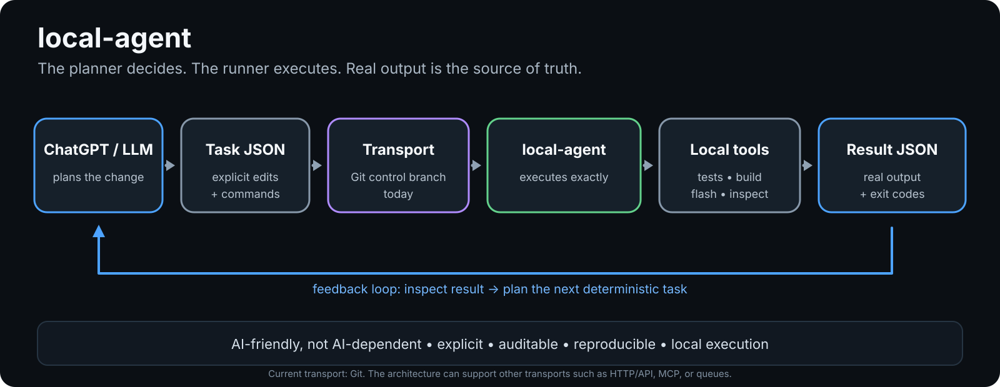

# local-agent

[](https://github.com/MichalMatu/local-agent/actions/workflows/ci.yml)


**The working, opinionated deterministic execution daemon used for real local development.**

`local-agent` is the practical implementation of the same planning/execution split that is being generalized in [`DeterministicRunner`](https://github.com/MichalMatu/DeterministicRunner).

ChatGPT decides the code changes and exact commands. `local-agent` executes them on the local machine and publishes machine-readable evidence back to the target repository.

> **The planner decides what to do. The daemon executes exactly what it was given. Real output is the source of truth.**



## Which repository should I use?

| Repository | Best for |
| --- | --- |
| [`MichalMatu/local-agent`](https://github.com/MichalMatu/local-agent) | Inspecting or continuing the working macOS/ESP32 implementation used in practice. |
| [`MichalMatu/DeterministicRunner`](https://github.com/MichalMatu/DeterministicRunner) | Starting a new, reusable, repository-agnostic setup. |

If you want to reproduce the concept on a different machine or target project, **start with DeterministicRunner**. `local-agent` intentionally contains environment-specific assumptions from the system it currently operates.

## What this repo does

The daemon can:

- consume explicit tasks from a Git control branch;
- run exact shell commands;
- build and test code;
- flash and inspect ESP32 hardware;
- capture bounded real command output and exit codes;
- publish remote task progress;
- publish terminal result JSON;
- expose daemon health remotely;
- accept durable `status`, `restart`, and `self_update` control requests;
- protect dirty disposable-workspace state with checkpoints before destructive cleanup.

The daemon is deliberately **not a coding model**.

## Current role and default target

This repository is execution infrastructure.

For the established workflow, the default product target is:

```text
MichalMatu/esp32s3_LiteGraph
```

with:

```text
target source branch: main
target control branch: agent-control
daemon repository: MichalMatu/local-agent
daemon source branch: main
```

Future AI sessions should treat `esp32s3_LiteGraph` as the product target unless the user explicitly asks to modify, audit, or debug `local-agent` itself.

## Environment assumptions

The current implementation is intentionally opinionated and is not a general cross-platform package.

It currently assumes:

- macOS / POSIX behavior including `fcntl`;
- Python 3.11+;
- Git;
- local control/work/checkpoint directories under `~/agent-workspace`;
- a daemon checkout normally at `~/local-agent`;
- `launchd` as the outer supervisor;
- a tool path that includes PlatformIO/Homebrew locations used by the current development machine.

The checked-in `com.michal.local-agent.plist` contains machine-specific absolute paths and is a reference for the current installation. **Do not copy it unchanged to another account or machine.**

For a portable/config-driven installation, use [`DeterministicRunner`](https://github.com/MichalMatu/DeterministicRunner).

---

## Quick start for development and validation

Clone the daemon:

```bash
git clone https://github.com/MichalMatu/local-agent.git ~/local-agent
cd ~/local-agent
```

Create a virtual environment:

```bash
python3 -m venv .venv
source .venv/bin/activate
```

The daemon code currently uses the Python standard library, so there is no package-install step required for the core runtime.

Validate the checkout:

```bash
python -m py_compile agentd.py agent_core.py agent_runtime.py agentctl.py
python -m unittest discover -q
```

Useful diagnostics:

```bash
./.venv/bin/python agentctl.py status
./.venv/bin/python agentctl.py doctor
./.venv/bin/python agentctl.py task <task-id>
./.venv/bin/python agentctl.py validate-task /path/to/task.json
```

`doctor` and live daemon operation expect the established local workspace/control topology to exist.

## Established local topology

The production workflow currently uses:

```text
~/local-agent
~/agent-workspace/control
~/agent-workspace/work
~/agent-workspace/checkpoints
~/Library/Application Support/local-agent
~/Library/Logs/local-agent.log
```

The user/project checkout is **not** the disposable agent worktree. The daemon must never reset or clean a human's working checkout as part of normal task execution.

## How the flow works

```text
ChatGPT / planner
      |
      v
explicit task JSON
      |
      v
Git control branch
      |
      v
local-agent daemon
      |
      +--> disposable work clone
      |       exact commands / tests / builds / flash / inspect
      |
      +--> durable local state
      |       claims / checkpoints / status / runs
      |
      v
machine-readable result + progress
      |
      v
planner inspects evidence and chooses the next task
```

## Remote observability

On the target repository's `agent-control` branch:

```text
.agent/status/daemon.json
.agent/runs/<task-id>.json
.agent/results/<task-id>.json
.agent/daemon/control.json
.agent/daemon/acks/<control-id>.json
```

Use them as follows:

- `.agent/status/daemon.json` — daemon health/state;
- `.agent/runs/<task-id>.json` — detailed current task progress;
- `.agent/results/<task-id>.json` — terminal execution result;
- `.agent/daemon/control.json` — remote daemon request;
- `.agent/daemon/acks/<control-id>.json` — durable acknowledgement.

The user should not need to paste live daemon output during normal operation. An AI planner should inspect the remote status/run/result files directly.

## Remote daemon control

Example:

```json
{
  "id": "restart-20260823-001",
  "action": "restart"
}
```

Supported actions:

- `status`;
- `restart`;
- `self_update`.

A handled command receives a durable acknowledgement so it is not replayed after restart.

## Golden-standard v4.2 guarantees

The current infrastructure contract is defined in [`GOLDEN_STANDARD.md`](GOLDEN_STANDARD.md). Important invariants include:

- `agentd.py` is the only daemon entry point;
- the daemon is a deterministic executor, never a coding model;
- one OS-locked daemon instance is allowed;
- every task has an immutable payload digest and unique attempt ID;
- a durable claim exists before side-effect-capable execution;
- a claimed/interrupted task is never automatically replayed;
- malformed task JSON becomes terminal `invalid_task_file`;
- corrupt durable claims are quarantined and fail closed;
- command, no-output, and whole-task watchdogs are mandatory;
- child processes execute in process groups and are terminated as a group;
- result publication may be retried, execution may not;
- self-update accepts only a clean fast-forward candidate that passes validation;
- target-project verification is impact-driven instead of blindly running unrelated broad suites;
- secrets never belong in Git-backed task/result/run/control data or repository documentation.

The daemon currently reports `DAEMON_VERSION = 4.2.1`.

## Workspace checkpoints

Before destructive reset/clean of the disposable worktree, the daemon checks whether it is dirty.

Dirty state is saved under:

```text
~/agent-workspace/checkpoints/<task-id>/
```

Tracked changes are preserved as a binary Git patch, non-ignored untracked files are copied byte-for-byte, and metadata records the base commit.

If checkpoint creation fails, cleanup is skipped and the task fails closed rather than destroying the only remaining copy.

Checkpoints are intentionally not deleted automatically.

## Time limits

Current defaults include:

```text
command timeout:   1200 s
no-output timeout:  600 s
whole-task timeout: 3600 s
```

Maximums are enforced by the daemon. `idle_timeout=0` disables only the no-output watchdog.

## Self-update

When idle, the daemon can check `local-agent/main` for a fast-forward update.

The update path validates the candidate locally, rejects/rolls back a bad update, records the rejected SHA, and restarts by `exec` only after validation succeeds. `launchd` remains the outer supervisor.

For non-trivial daemon changes, use the isolated release flow described in [`SESSION_BOOTSTRAP.md`](SESSION_BOOTSTRAP.md) and [`GOLDEN_STANDARD.md`](GOLDEN_STANDARD.md). Never prepare a daemon release by mutating the checkout that is currently running `agentd.py`.

## Live logs

Latest 30 lines:

```bash
tail -n 30 ~/Library/Logs/local-agent.log
```

Follow the log:

```bash
tail -n 30 -f ~/Library/Logs/local-agent.log
```

Stop following with `Ctrl+C`.

Remote `.agent/status`, `.agent/runs`, and `.agent/results` remain the authoritative normal-operation interface for an AI planner.

## For AI assistants and future sessions

`SESSION_BOOTSTRAP.md` is the canonical cross-repository entry point.

Before queueing work, an AI system should read:

1. [`SESSION_BOOTSTRAP.md`](SESSION_BOOTSTRAP.md);
2. [`AGENTS.md`](AGENTS.md);
3. [`LOCAL_AGENT_FLOW.md`](LOCAL_AGENT_FLOW.md);
4. [`LOCAL_AGENT_AUTOPILOT.md`](LOCAL_AGENT_AUTOPILOT.md) when autonomous execution is requested;
5. [`GOLDEN_STANDARD.md`](GOLDEN_STANDARD.md);
6. the target repository's own `AGENTS.md` and relevant path-specific instructions.

Then it should:

- inspect remote daemon/task state before queueing anything;
- follow an existing `attempt_id`/`task_digest` instead of creating a duplicate task;
- select verification from realistic change impact rather than ritual;
- distinguish tested source from published source;
- distinguish published firmware source from firmware actually flashed/running on hardware;
- use exact evidence instead of inference;
- keep all machine-generated execution content in English;
- keep secrets out of Git-backed control/evidence files.

## Source of truth

Use this order:

1. real local-agent command/result evidence;
2. target repository source and tests;
3. remote run/daemon status;
4. planner analysis.

Do not claim success until the requested gates are actually green and the intended source has been published. Hardware validation requires explicit evidence that the intended firmware was uploaded or an exact build-identity mechanism proves the running revision.

## Safety

`local-agent` executes commands with the permissions of the local user running it.

The Git control branch is therefore trusted-code input. Anyone who can publish accepted task commands can exercise those local privileges.

Never commit passwords, API tokens, bearer tokens, private keys, or session material to:

```text
.agent/tasks
.agent/runs
.agent/results
.agent/daemon
```

Keep authentication material in a local non-versioned secret store such as macOS Keychain or an equivalent mechanism.

## Development

Canonical validation:

```bash
python -m py_compile agentd.py agent_core.py agent_runtime.py agentctl.py
python -m unittest discover -q
```

For infrastructure changes, follow the release gate in [`GOLDEN_STANDARD.md`](GOLDEN_STANDARD.md): isolated staging, local validation, green CI on the exact candidate SHA, fast-forward `main`, daemon self-update, remote version verification, and one real queue smoke task.

## Design principle

> **The planner decides what to do. The daemon executes exactly what it was given and reports what actually happened.**
