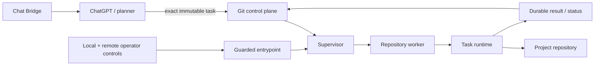
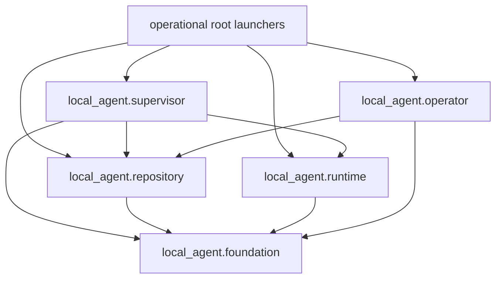
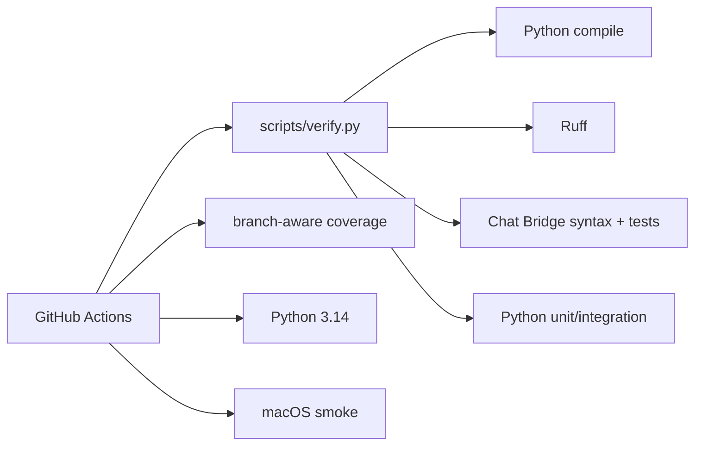

# Local Agent architecture

> **Design goal:** keep planning outside the executor and make local execution deterministic, bounded, observable and recoverable.

This document describes the current code ownership boundaries. Runtime truth still comes from `main`, `AGENTS.md`, operational documentation and live daemon evidence.

## System boundary



The planner chooses intent. The executor independently owns repository identity, hard binding, resource admission, process lifecycle, watchdogs, checkpoints, publication and emergency stop.

## Package map

```text
local_agent/
├── __init__.py
├── config.py
├── paths.py
├── entrypoint.py
├── version.py
├── cli/
│   └── diagnostics.py
├── daemon/
│   ├── installation.py
│   └── service.py
├── foundation/
│   ├── core.py
│   ├── process.py
│   └── storage.py
├── operator/
│   ├── local.py
│   └── remote.py
├── platform/
│   └── macos_launchd.py
├── repository/
│   ├── admin.py
│   ├── binding.py
│   ├── cleanup.py
│   ├── context.py
│   └── worker.py
├── runtime/
│   ├── executor.py
│   ├── output.py
│   ├── progress.py
│   ├── task_contract.py
│   └── telemetry.py
└── supervisor/
    ├── control.py
    ├── policy.py
    ├── orchestrator.py
    ├── serial.py
    ├── resources.py
    ├── scheduling.py
    └── worker.py
```

The package is the implementation home for reusable code. New implementation must not be added to a root compatibility module when a packaged owner exists.

## Ownership boundaries

| Area | Owner | Responsibilities |
| --- | --- | --- |
| Installation transaction | `local_agent/daemon/installation.py` | installation lock, durable pending revisions and fail-closed admission after interrupted validation |
| Daemon service | `local_agent/daemon/service.py` | lifecycle, durable claims/results, control and validated self-update |
| Parallel orchestration | `local_agent/supervisor/orchestrator.py` | side-effect coordination: worker admission/reaping, control probing/draining, status publication and shutdown |
| Serial fallback | `local_agent/supervisor/serial.py` | serial repository polling and mode-preserving restart |
| Checkout paths | `local_agent/paths.py` | explicit source checkout resolution, independent of cwd |
| Release version | `local_agent/version.py` | one release version constant |
| Runtime configuration | `local_agent/config.py` | startup-loaded timeout policy |
| Execution core | `local_agent/foundation/core.py` | deterministic task execution, workspace preparation/checkpointing and result publication |
| Process foundation | `local_agent/foundation/process.py` | registered spawning, process groups, bounded stdout, durable writes and inherited lease FDs |
| Storage foundation | `local_agent/foundation/storage.py` | bounded control Git sync, resilient network retry and storage diagnostics |
| Repository identity | `local_agent/repository/context.py` | registry parsing, workspace identity, config digests and lease keys |
| Hard binding | `local_agent/repository/binding.py` | canonical UUID identity and control-binding validation |
| Repository administration | `local_agent/repository/admin.py` | explicit provisioning and checkout validation |
| Repository runtime cleanup | `local_agent/repository/cleanup.py` | bounded terminal metadata GC with path-exact publication |
| Repository worker | `local_agent/repository/worker.py` | one isolated repository turn, binding admission and repository-scoped controls |
| Task executor | `local_agent/runtime/executor.py` | staged command lifecycle, time/RSS watchdog orchestration and task-level execution budget |
| Task contract | `local_agent/runtime/task_contract.py` | task limits, digest/binding/resource validation |
| Output | `local_agent/runtime/output.py` | bounded live/summary rendering |
| Progress | `local_agent/runtime/progress.py` | validated progress markers and bounded async publication |
| Telemetry | `local_agent/runtime/telemetry.py` | host/process telemetry parsing and collection |
| Local emergency state | `local_agent/operator/local.py` | persistent disable marker, disabled-only runtime reset and binding migration |
| Remote emergency intent | `local_agent/operator/remote.py` | central operator desired-state polling and fail-closed validation |
| Guarded service lifecycle | `local_agent/entrypoint.py` | operator polling plus safe supervisor start/stop/reexec |
| Diagnostics CLI | `local_agent/cli/diagnostics.py` | status, task inspection, task validation and doctor checks |
| Supervisor polling policy | `local_agent/supervisor/policy.py` | shared adaptive polling/order/time policy |
| Production scheduling | `local_agent/supervisor/scheduling.py` | pure retry/due/backoff/max-worker policy plus control-probe retry/admission state and `RETRY` / `PAUSE_CONTROL_REPOSITORY` / `DRAIN_ALL` classification |
| Resource admission | `local_agent/supervisor/resources.py` | machine/named-resource flock arbitration and inherited resource FDs |
| Parallel repository worker | `local_agent/supervisor/worker.py` | resource-aware parallel task admission and dispatch |
| macOS integration | `local_agent/platform/macos_launchd.py` | portable LaunchAgent generation/lifecycle helpers |

The control-admission boundary is deliberate: `scheduling.py` owns deterministic state transitions and policy decisions and has no Git/process/daemon side effects. `orchestrator.py` observes real probe outcomes and executes the chosen side effect. This keeps BUG-002 handling directly testable without embedding another policy state machine in the supervisor loop.

## Root boundary

All implementation lives under `local_agent/`. Four root Python files remain as operational launchers, with no module aliases or `__file__` mutation:

| Launcher | Operational requirement |
| --- | --- |
| `agent_entrypoint.py` | installed guarded LaunchAgent and guard self-reexec |
| `agent_parallel.py` | existing direct parallel LaunchAgents and parallel self-update/restart |
| `agent_multirepo.py` | serial LaunchAgent, daemon registry dispatch and serial restart |
| `agentd.py` | single-daemon LaunchAgent and daemon self-update/restart |

Keeping these filenames preserves installed launchd configuration and explicit restart commands. The v4.17 updater still needs an operator-managed transition because its in-memory validator names deleted files; see [v4.18 release notes](RELEASE_NOTES_V4.18.0.md). They are executable boundaries, not supported import APIs. All other root aliases and worker/admin/diagnostic/operator shims are removed.

Workers run as package modules with an explicit checkout cwd. Direct supervisor module invocation is also supported. Restart uses an absolute launcher under `repository_root()` and preserves the exact serial/parallel mode, registry, one-shot flag and worker count. The daemon's `SELF_REPO` uses the same resolver for Git revision and self-update. Installed-update compile discovery delegates to `scripts/verify.py --only compile`; validation still isolates HOME, strips lease metadata, bounds each command and runs the full Python suite before accepting an update.

The guard and updater serialize source acceptance through an installation lock. The updater records both revisions durably before installing the inspected commit. Validation failure rolls back; interrupted validation leaves a journal that blocks supervisor startup and local enable until operator recovery. The guard keeps emergency polling active while validation is running. See [operations](OPERATIONS.md#interrupted-self-update-recovery).

`tests/test_package_layout.py` enforces this boundary and tests launcher/module execution and restart paths. The launchd generator keeps the installed launcher contract and validates packaged runtime files before installation.

## Dependency direction

The intended direction is:



Packaged modules and tests import packaged owners directly. Imports of root launcher names are unsupported and prohibited.

## Remaining decomposition opportunities

The daemon service and parallel orchestrator remain substantial coordination modules, but that alone is not a reason for a risky cosmetic split. Extract a responsibility only when it has a clear owner, deterministic contract and focused tests.

For v4.18.14, control-probe retry/admission state was extracted into the existing scheduling owner rather than creating a new one-off module. `orchestrator.py` still coordinates real worker/process/control side effects; it no longer owns the BUG-002 retry counters or the known-worker-vs-unexplained-holder policy decision.

Future candidates may extract supervisor status/process coordination or daemon update operations if doing so reduces coupling without changing claim/result, update rollback, resource admission, control drain or shutdown behavior.

The scheduling extraction remains direct: production calls `scheduling.py` and scheduling tests exercise that owner; supervisor and temporary-Git integration tests exercise its production consumers.

## Safety invariants that layout work must not weaken

> [!CAUTION]
> Refactoring file layout is never a reason to weaken an executor invariant.

- repository/control/task agent bindings must match before execution;
- global disabled state takes precedence over task admission;
- interrupted claimed work is never silently replayed;
- publication retry may republish evidence but may not rerun commands;
- command output, task time and RSS remain bounded;
- repository and resource lease FDs remain inherited through descendants;
- resource contention occurs before claim and remains durable waiting;
- global maintenance drains active workers and acquires repository identities;
- confirmed pending global control drains immediately;
- unexplained repeated control-repository lease contention remains fail-closed through bounded global drain;
- remote operator `enabled` never clears the persistent local disable marker;
- dirty workspaces are never destructively replaced without recoverable evidence;
- daemon/self-update and supervisor restart paths must still resolve to the installed root checkout.

## Verification architecture

The executable verification source of truth is:

```bash
python scripts/verify.py
```



Package-layout changes additionally require `tests/test_package_layout.py` to stay green so moved implementations cannot silently grow back into root shims.

Coverage remains a risk map, not a vanity gate. Lower-covered orchestration and shutdown paths deserve targeted tests before cosmetic decomposition. Current-documentation and release-metadata contract tests prevent operational examples and release identity from silently drifting behind runtime behavior.

## macOS service boundary

Tracked machine-specific plist files are replaced by generated configuration:

```bash
.venv/bin/python scripts/macos_launchd.py render
.venv/bin/python scripts/macos_launchd.py install --mode parallel --max-workers 4
.venv/bin/python scripts/macos_launchd.py restart --mode parallel --max-workers 4
```

`install` is intentionally non-disruptive. `restart` is the explicit service interruption boundary.

## Browser transport boundary

`chat_bridge/service_worker.js` is composition-only. Worker responsibilities are split by ownership: `worker_state.js` serializes Chrome storage, `worker_runtime.js` validates/caches runtime configuration, `worker_binding.js` owns hard-binding lookup and prompt policy, `worker_schedule.js` owns alarms, `worker_transport.js` owns tab/content-script transport and delivery authorization, `worker_controls.js` owns assistant control transitions, `worker_delivery.js` owns one delivery lifecycle, `worker_conversations.js` owns operator conversation/global-setting mutations, and `worker_events.js` routes Chrome events/messages. `worker_base.js` contains only shared constants and small process-local registries.

`content.js` owns ChatGPT DOM interaction and observable delivery confirmation. `bridge_state.js` owns state normalization; `control_protocol.js` owns marker/identity parsing. `popup.js` owns explicit operator rendering/actions, while `popup_live.js` owns live popup synchronization and in-place state patching. Content messages cannot invoke popup-only configuration or Rebind operations, and assistant controls may alter only per-conversation state; they can never mutate the global Master switch.

Bridge keeps no durable ambiguous-delivery journal. A lost post-submit confirmation is diagnostic `delivery_unconfirmed` only and never creates `pendingDelivery` or blocks future controls. Only an actively running delivery is protected by an in-memory overlap guard, which disappears when the send completes or the worker restarts.

The planner chooses direct GitHub edits with sufficient diff/CI evidence or bounded local execution. Neither the Bridge nor the daemon chooses implementation work. See [the planner contract](AUTONOMOUS_CHAT_LOOP.md) and [the Bridge audit](RELEASE_NOTES_V4.18.1.md).
