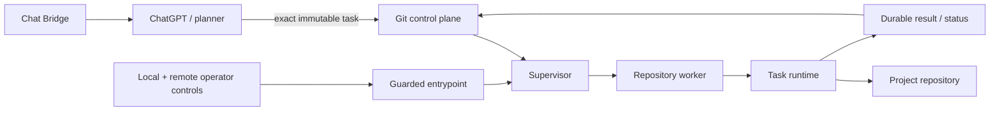
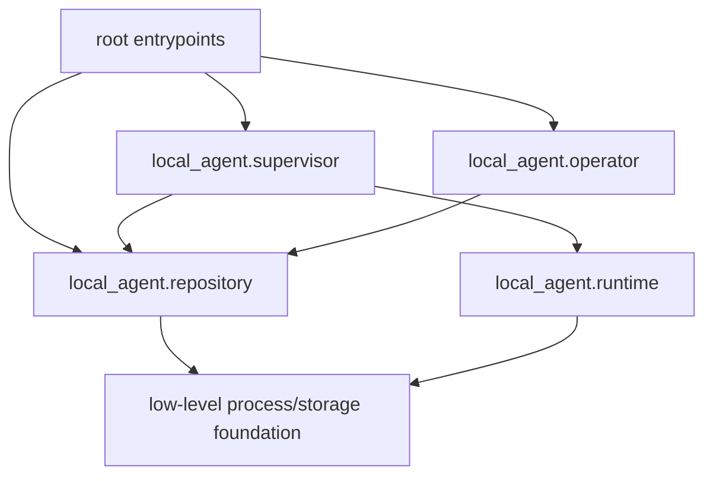
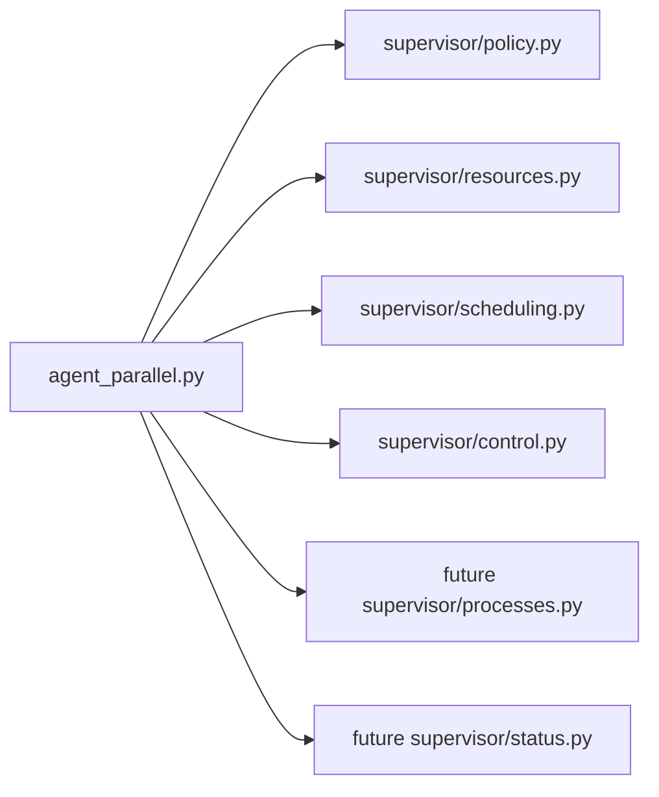
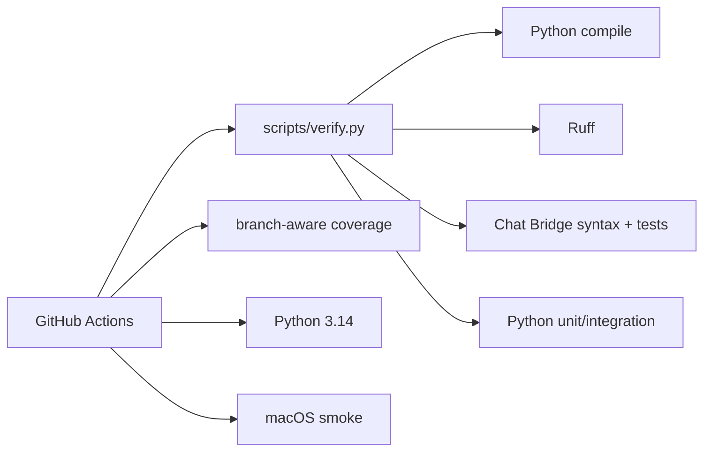

# Local Agent architecture

> **Design goal:** keep planning outside the executor and make local execution deterministic, bounded, observable and recoverable.

This document describes the current module boundaries and the direction of the v4.16 architecture cleanup. Runtime truth still comes from `main`, `AGENTS.md`, operational documentation and live daemon evidence.

## System boundary



The planner chooses intent. The executor independently owns repository identity, hard binding, resource admission, process lifecycle, watchdogs, checkpoints, publication and emergency stop.

## Package map

```text
local_agent/
├── config.py
├── operator/
│   ├── local.py
│   └── remote.py
├── platform/
│   └── macos_launchd.py
├── repository/
│   ├── binding.py
│   └── context.py
├── runtime/
│   ├── output.py
│   ├── progress.py
│   ├── task_contract.py
│   └── telemetry.py
└── supervisor/
    ├── control.py
    ├── policy.py
    ├── resources.py
    └── scheduling.py
```

The root `agent_*.py` files are currently a mixture of production entrypoints and legacy import surfaces. The refactor moves implementation into `local_agent/` while keeping only genuinely executable entrypoints at repository root.

## Ownership boundaries

| Area | Owner | Responsibilities |
| --- | --- | --- |
| Runtime configuration | `local_agent/config.py` | startup-loaded timeout policy |
| Repository identity | `local_agent/repository/context.py` | registry parsing, workspace identity, lease keys |
| Hard binding | `local_agent/repository/binding.py` | canonical UUID identity and control-binding validation |
| Local emergency state | `local_agent/operator/local.py` | persistent disable marker, disabled-only runtime reset and binding migration |
| Remote emergency intent | `local_agent/operator/remote.py` | central operator branch polling and fail-closed validation |
| Task contract | `local_agent/runtime/task_contract.py` | task limits, digest/binding/resource validation |
| Output | `local_agent/runtime/output.py` | bounded rendering and diagnostic tails |
| Progress | `local_agent/runtime/progress.py` | validated progress markers/publication |
| Telemetry | `local_agent/runtime/telemetry.py` | host/process telemetry and RSS sampling |
| Supervisor policy | `local_agent/supervisor/policy.py` | shared polling/control policy |
| Scheduling policy | `local_agent/supervisor/scheduling.py` | pure retry/due/backoff/max-worker decisions |
| Resource admission | `local_agent/supervisor/resources.py` | machine/named-resource flock arbitration and inherited resource FDs |
| macOS integration | `local_agent/platform/macos_launchd.py` | portable LaunchAgent generation/lifecycle helpers |

## Dependency direction

The desired direction is:



Package modules should not depend upward on convenience wrappers in the repository root once a packaged implementation exists. Temporary aliases are permitted only during the migration and should be removed after all callers move.

### Known transitional edges

The current refactor intentionally still has a few upward dependencies:

- `local_agent/operator/local.py` uses root process durability helpers;
- `local_agent/operator/remote.py` uses the current root core process/log interface;
- `local_agent/supervisor/resources.py` uses the current root process lease primitives;
- scheduler orchestration still lives primarily in `agent_parallel.py`.

These are migration seams, not target architecture.

## Root entrypoint target

The long-term root should contain only small commands that are useful to humans, launchd or subprocess workers. Their implementation should delegate into packages.

A reasonable target is:

```text
agentd.py                 daemon CLI / compatibility entrypoint
agent_entrypoint.py       guarded service entrypoint
agent_parallel.py         parallel supervisor CLI
agent_parallel_worker.py  isolated worker CLI
agent_multirepo.py        serial fallback CLI
agent_repo_admin.py       repository administration CLI
agent_operator.py         emergency operator CLI
agentctl.py               diagnostics CLI
agent_version.py          release version
```

Files such as `agent_config.py`, `agent_binding.py` and `agent_repository.py` are temporary import surfaces during the refactor and should disappear once direct package imports are complete.

## Supervisor decomposition

`agent_parallel.py` remains the largest architectural concentration. It currently combines:

1. command-line parsing and startup;
2. process spawning/reaping;
3. retry/backoff scheduling;
4. repository ordering/admission;
5. global control draining/probing;
6. status publication;
7. local log maintenance;
8. shutdown/signal handling.

The extraction sequence is deliberately incremental:



Pure policy is extracted before process/Git orchestration because it is easier to prove behavior-preserving with direct tests.

## Safety invariants that module movement must not weaken

> [!CAUTION]
> Refactoring file layout is never a reason to weaken an executor invariant.

- repository/control/task agent bindings must match before execution;
- global disabled state takes precedence over task admission;
- interrupted claimed work is never silently replayed;
- publication retry may republish evidence but may not rerun commands;
- command output, task time and RSS remain bounded;
- repository and resource lease FDs remain inherited through descendants;
- resource contention occurs before claim and remains durable waiting;
- global maintenance drains active workers and acquires repository identities;
- remote operator `enabled` never clears the persistent local disable marker;
- dirty workspaces are never destructively replaced without recoverable evidence.

## Verification architecture

The executable verification source of truth is:

```bash
python scripts/verify.py
```



Coverage is a risk map, not a vanity gate. A lower-coverage scheduler failure path is more valuable to test than adding trivial assertions to a well-covered helper merely to increase the total percentage.

## macOS service boundary

Tracked machine-specific plist files have been replaced by generated configuration:

```bash
.venv/bin/python scripts/macos_launchd.py render
.venv/bin/python scripts/macos_launchd.py install --mode parallel --max-workers 2
.venv/bin/python scripts/macos_launchd.py restart --mode parallel --max-workers 2
```

`install` is intentionally non-disruptive. `restart` is the explicit service interruption boundary.

## Refactor release gate

The architecture refactor is complete only when all of the following are true:

- package ownership in this document matches code reality;
- temporary aliases have either been removed or explicitly justified;
- no package module imports a root compatibility wrapper when a packaged dependency exists;
- exact candidate compile/lint/full tests are green;
- Python 3.14 compatibility is green;
- macOS smoke is green;
- critical scheduler/operator/process paths have targeted evidence;
- docs and downstream planner contracts have been audited;
- the live daemon is restarted only during an idle/safe window;
- live status revision/version and a real queued task are verified after restart.
