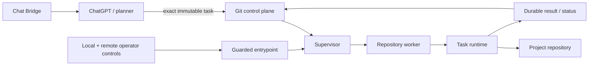
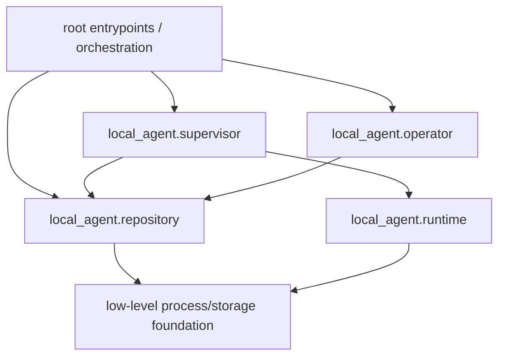
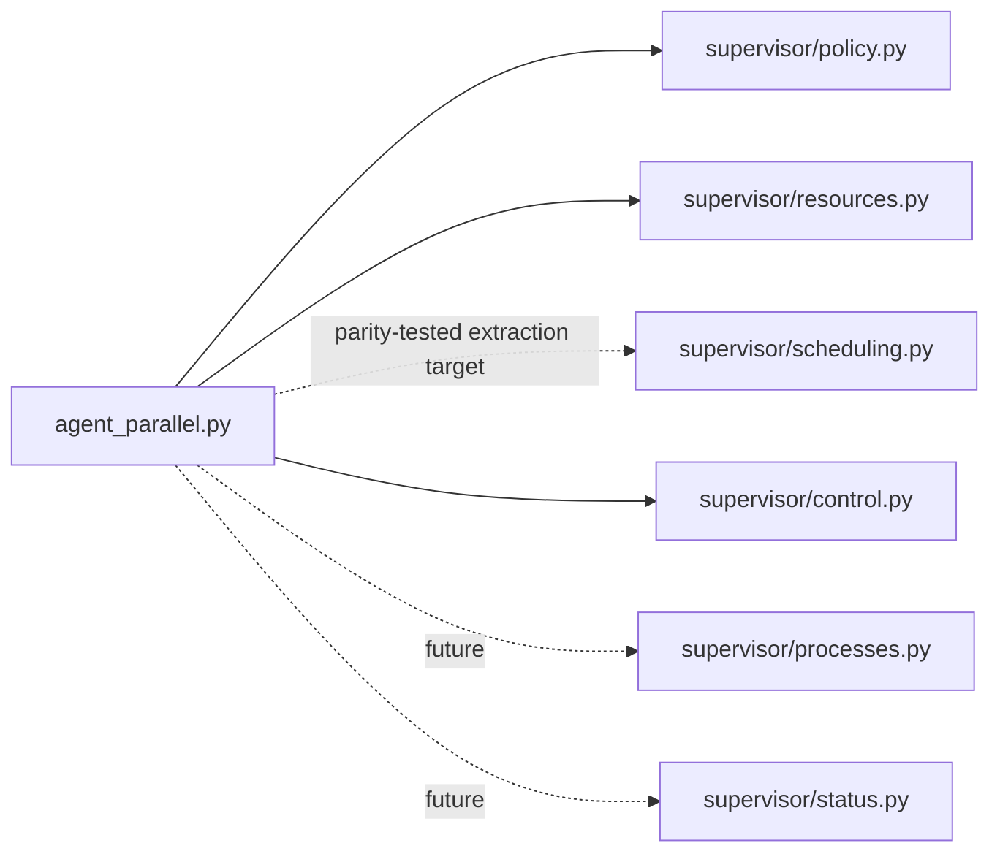
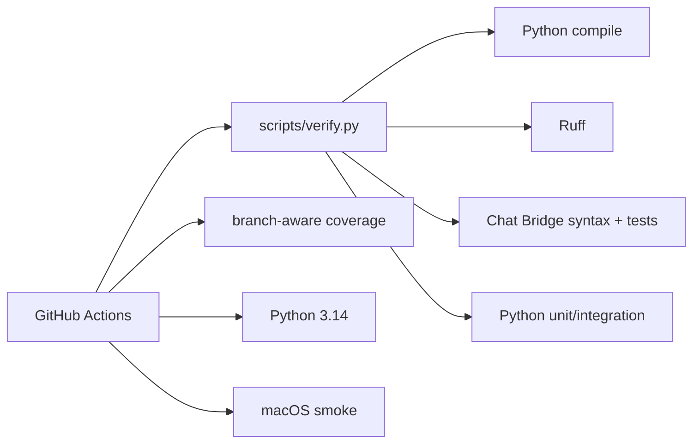

# Local Agent architecture

> **Design goal:** keep planning outside the executor and make local execution deterministic, bounded, observable and recoverable.

This document describes the current module boundaries established by the v4.16 architecture cleanup. Runtime truth still comes from `main`, `AGENTS.md`, operational documentation and live daemon evidence.

## System boundary



The planner chooses intent. The executor independently owns repository identity, hard binding, resource admission, process lifecycle, watchdogs, checkpoints, publication and emergency stop.

## Package map

```text
local_agent/
├── config.py
├── entrypoint.py
├── operator/
│   ├── local.py
│   └── remote.py
├── platform/
│   └── macos_launchd.py
├── repository/
│   ├── binding.py
│   └── context.py
├── runtime/
│   ├── output.py
│   ├── progress.py
│   ├── task_contract.py
│   └── telemetry.py
└── supervisor/
    ├── control.py
    ├── policy.py
    ├── resources.py
    └── scheduling.py
```

Root `agent_*.py` files are now either production executables/orchestrators or deliberately retained compatibility import surfaces. New implementation belongs in `local_agent/` whenever a packaged owner exists.

## Ownership boundaries

| Area | Owner | Responsibilities |
| --- | --- | --- |
| Guarded service lifecycle | `local_agent/entrypoint.py` | remote operator polling, safe supervisor start/stop/reexec and repository preparation |
| Runtime configuration | `local_agent/config.py` | startup-loaded timeout policy |
| Repository identity | `local_agent/repository/context.py` | registry parsing, workspace identity, lease keys |
| Hard binding | `local_agent/repository/binding.py` | canonical UUID identity and control-binding validation |
| Local emergency state | `local_agent/operator/local.py` | persistent disable marker, disabled-only runtime reset and binding migration |
| Remote emergency intent | `local_agent/operator/remote.py` | central operator branch polling and fail-closed validation |
| Task contract | `local_agent/runtime/task_contract.py` | task limits, digest/binding/resource validation |
| Output | `local_agent/runtime/output.py` | bounded rendering and diagnostic tails |
| Progress | `local_agent/runtime/progress.py` | validated progress markers/publication |
| Telemetry | `local_agent/runtime/telemetry.py` | host/process telemetry and RSS sampling |
| Supervisor policy | `local_agent/supervisor/policy.py` | shared polling/control policy |
| Scheduling extraction target | `local_agent/supervisor/scheduling.py` | pure retry/due/backoff/max-worker model kept in parity with the released orchestrator |
| Resource admission primitives | `local_agent/supervisor/resources.py` | machine/named-resource flock arbitration and inherited resource FDs |
| Parallel orchestration | `agent_parallel.py` | released process/control/status orchestration and current production scheduling semantics |
| macOS integration | `local_agent/platform/macos_launchd.py` | portable LaunchAgent generation/lifecycle helpers |

## Dependency direction

The intended direction is:



Package modules should not depend upward on convenience wrappers in the repository root once a packaged implementation exists. Compatibility aliases are retained only where current runtime/test import seams still require them and must not become new implementation owners.

### Remaining foundation seams

The v4.16 refactor intentionally does not perform a high-risk rewrite of the low-level process/core/supervisor foundation immediately before deployment:

- `local_agent/operator/local.py` uses root process durability helpers;
- `local_agent/operator/remote.py` uses the current root core process/log interface;
- `local_agent/supervisor/resources.py` uses the current root process lease primitives;
- process/control/status orchestration and released retry/due/backoff scheduling behavior still live in `agent_parallel.py`;
- `local_agent/supervisor/scheduling.py` is the directly tested extraction target, with parity tests preventing silent drift until a later focused rewire.

These seams are explicit and tested. Future decomposition should move them in small behavior-preserving steps rather than by copying the entire supervisor at once.

## Root entrypoints and compatibility surfaces

The root intentionally keeps executable commands used by humans, launchd or subprocess workers:

```text
agentd.py                 daemon core / compatibility entrypoint
agent_entrypoint.py       thin executable/import shim -> local_agent.entrypoint
agent_parallel.py         parallel supervisor orchestration CLI
agent_parallel_worker.py  isolated worker CLI
agent_multirepo.py        serial fallback CLI
agent_repo_admin.py       repository administration CLI
agent_operator.py         thin local-operator CLI/import shim
agentctl.py               diagnostics CLI
agent_version.py          release version
```

`agent_config.py`, `agent_binding.py`, `agent_repository.py` and `agent_remote_operator.py` remain compatibility import surfaces for existing callers. They are not implementation ownership locations.

## Supervisor decomposition

`agent_parallel.py` remains the largest orchestration concentration. It coordinates:

1. command-line parsing and startup;
2. process spawning/reaping;
3. retry/backoff scheduling;
4. repository ordering/admission;
5. global control draining/probing;
6. status publication;
7. local log maintenance;
8. shutdown/signal handling.

The first decomposition steps are already isolated and directly tested:



Resource locking is already used by the runtime. Pure scheduling policy has been extracted and placed under parity tests first, but the released orchestrator remains the production owner until a separate focused rewire removes the duplicate implementation. This avoids a large late-stage rewrite while making future extraction mechanically checkable.

## Safety invariants that module movement must not weaken

> [!CAUTION]
> Refactoring file layout is never a reason to weaken an executor invariant.

- repository/control/task agent bindings must match before execution;
- global disabled state takes precedence over task admission;
- interrupted claimed work is never silently replayed;
- publication retry may republish evidence but may not rerun commands;
- command output, task time and RSS remain bounded;
- repository and resource lease FDs remain inherited through descendants;
- resource contention occurs before claim and remains durable waiting;
- global maintenance drains active workers and acquires repository identities;
- remote operator `enabled` never clears the persistent local disable marker;
- dirty workspaces are never destructively replaced without recoverable evidence.

## Verification architecture

The executable verification source of truth is:

```bash
python scripts/verify.py
```



Coverage is a risk map, not a vanity gate. A lower-coverage scheduler failure path is more valuable to test than adding trivial assertions to a well-covered helper merely to increase the total percentage.

## macOS service boundary

Tracked machine-specific plist files have been replaced by generated configuration:

```bash
.venv/bin/python scripts/macos_launchd.py render
.venv/bin/python scripts/macos_launchd.py install --mode parallel --max-workers 2
.venv/bin/python scripts/macos_launchd.py restart --mode parallel --max-workers 2
```

`install` is intentionally non-disruptive. `restart` is the explicit service interruption boundary.

## v4.16 release gate

The architecture refactor is release-ready when all of the following are true:

- package ownership in this document matches code reality;
- retained root aliases are explicitly classified as compatibility surfaces rather than implementation owners;
- no package module imports a root compatibility wrapper when a packaged dependency already exists;
- extracted-but-not-yet-rewired scheduling behavior is protected by explicit parity tests against the released orchestrator;
- exact-candidate compile/lint/full tests are green;
- Python 3.14 compatibility is green;
- macOS smoke is green;
- critical scheduler/operator/process paths have targeted evidence;
- downstream planner contracts have been audited and either updated or explicitly found unchanged;
- the live daemon is updated/restarted only during an idle/safe window;
- live status revision/version and one real queued task are verified after update.
