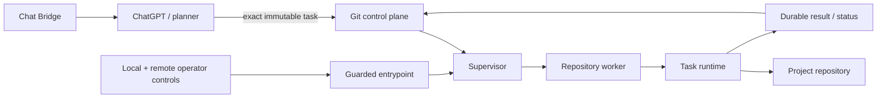
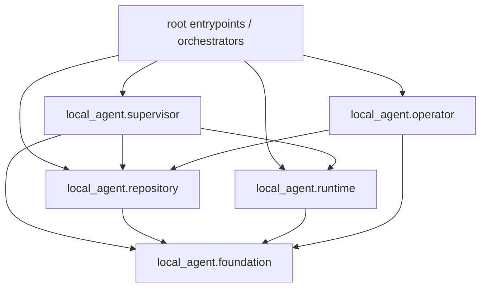
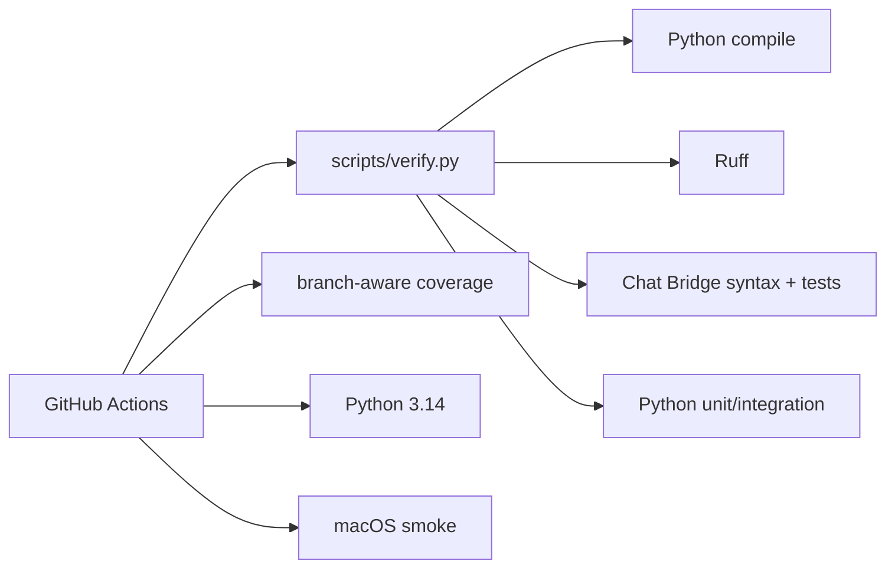

# Local Agent architecture

> **Design goal:** keep planning outside the executor and make local execution deterministic, bounded, observable and recoverable.

This document describes the current code ownership boundaries. Runtime truth still comes from `main`, `AGENTS.md`, operational documentation and live daemon evidence.

## System boundary



The planner chooses intent. The executor independently owns repository identity, hard binding, resource admission, process lifecycle, watchdogs, checkpoints, publication and emergency stop.

## Package map

```text
local_agent/
├── __init__.py
├── config.py
├── entrypoint.py
├── version.py
├── cli/
│   └── diagnostics.py
├── foundation/
│   ├── core.py
│   ├── process.py
│   └── storage.py
├── operator/
│   ├── local.py
│   └── remote.py
├── platform/
│   └── macos_launchd.py
├── repository/
│   ├── admin.py
│   ├── binding.py
│   ├── cleanup.py
│   ├── context.py
│   └── worker.py
├── runtime/
│   ├── executor.py
│   ├── output.py
│   ├── progress.py
│   ├── task_contract.py
│   └── telemetry.py
└── supervisor/
    ├── control.py
    ├── policy.py
    ├── resources.py
    ├── scheduling.py
    └── worker.py
```

The package is the implementation home for reusable code. New implementation must not be added to a root compatibility module when a packaged owner exists.

## Ownership boundaries

| Area | Owner | Responsibilities |
| --- | --- | --- |
| Release version | `local_agent/version.py` | one release version constant |
| Runtime configuration | `local_agent/config.py` | startup-loaded timeout policy |
| Execution core | `local_agent/foundation/core.py` | deterministic task execution, workspace preparation/checkpointing and result publication |
| Process foundation | `local_agent/foundation/process.py` | registered spawning, process groups, bounded stdout, durable writes and inherited lease FDs |
| Storage foundation | `local_agent/foundation/storage.py` | bounded control Git sync, resilient network retry and storage diagnostics |
| Repository identity | `local_agent/repository/context.py` | registry parsing, workspace identity, config digests and lease keys |
| Hard binding | `local_agent/repository/binding.py` | canonical UUID identity and control-binding validation |
| Repository administration | `local_agent/repository/admin.py` | explicit provisioning and checkout validation |
| Repository runtime cleanup | `local_agent/repository/cleanup.py` | bounded terminal metadata GC with path-exact publication |
| Repository worker | `local_agent/repository/worker.py` | one isolated repository turn, binding admission and repository-scoped controls |
| Task executor | `local_agent/runtime/executor.py` | staged command lifecycle, time/RSS watchdog orchestration and task-level execution budget |
| Task contract | `local_agent/runtime/task_contract.py` | task limits, digest/binding/resource validation |
| Output | `local_agent/runtime/output.py` | bounded live/summary rendering |
| Progress | `local_agent/runtime/progress.py` | validated progress markers and bounded async publication |
| Telemetry | `local_agent/runtime/telemetry.py` | host/process telemetry parsing and collection |
| Local emergency state | `local_agent/operator/local.py` | persistent disable marker, disabled-only runtime reset and binding migration |
| Remote emergency intent | `local_agent/operator/remote.py` | central operator desired-state polling and fail-closed validation |
| Guarded service lifecycle | `local_agent/entrypoint.py` | operator polling plus safe supervisor start/stop/reexec |
| Diagnostics CLI | `local_agent/cli/diagnostics.py` | status, task inspection, task validation and doctor checks |
| Supervisor policy | `local_agent/supervisor/policy.py` | shared polling/order/control policy |
| Scheduling extraction target | `local_agent/supervisor/scheduling.py` | pure retry/due/backoff/max-worker model, parity-protected against production parallel orchestration |
| Resource admission | `local_agent/supervisor/resources.py` | machine/named-resource flock arbitration and inherited resource FDs |
| Parallel repository worker | `local_agent/supervisor/worker.py` | resource-aware parallel task admission and dispatch |
| macOS integration | `local_agent/platform/macos_launchd.py` | portable LaunchAgent generation/lifecycle helpers |

## Root boundary

The repository root is no longer an implementation bucket. It contains two kinds of Python files.

### Production entrypoints/orchestrators

```text
agentd.py          daemon lifecycle, durable claims/results, control and self-update
agent_parallel.py  released bounded-parallel supervisor orchestration
agent_multirepo.py serial fallback supervisor orchestration
```

These three remain root owners intentionally because their current restart/self-update/subprocess contracts depend on stable root entrypoint paths. Moving them is a behavior change, not a cosmetic file move, and must be handled separately with explicit restart-path tests.

### Thin executable/compatibility surfaces

```text
agent_entrypoint.py
agent_operator.py
agent_repo_admin.py
agent_repo_worker.py
agent_parallel_worker.py
agentctl.py

agent_binding.py
agent_cleanup.py
agent_config.py
agent_core.py
agent_process.py
agent_remote_operator.py
agent_repository.py
agent_runtime.py
agent_storage.py
agent_version.py
```

These files are not implementation owners. They point at packaged modules so existing executable/import seams keep one module object rather than a second wrapper implementation. `tests/test_package_layout.py` enforces both module identity and a strict thin-source bound.

Do not add new callers to compatibility import names. New code should import the packaged owner directly. Compatibility surfaces may be removed once all runtime, tests and deployment entrypoints have migrated.

## Dependency direction

The intended direction is:



Packaged modules should increasingly import other packaged owners directly. A package-to-root compatibility import is a migration seam, not an accepted new dependency direction.

## Remaining orchestration seams

Three root orchestrators remain deliberately large:

- `agentd.py` still owns durable claims/results, control publication and validated self-update. Its `SELF_REPO` and restart logic are path-sensitive.
- `agent_multirepo.py` remains the serial fallback and restarts through its own root entrypoint path.
- `agent_parallel.py` remains the released production supervisor and coordinates process spawning/reaping, repository admission, global control draining, status publication, log maintenance and shutdown.

`local_agent/supervisor/scheduling.py` remains a directly tested extraction target. Its behavior is kept in parity with `agent_parallel.py`, but the production orchestrator is still the scheduling owner until a focused rewire removes the duplicate implementation. Do not claim that migration is complete before that rewire lands.

Future decomposition should prefer small behavior-preserving slices such as:

```text
local_agent/supervisor/processes.py
local_agent/supervisor/status.py
local_agent/daemon/service.py
local_agent/daemon/update.py
```

A file move that changes `__file__`-derived restart or self-update paths requires explicit tests and is not a mechanical refactor.

## Safety invariants that layout work must not weaken

> [!CAUTION]
> Refactoring file layout is never a reason to weaken an executor invariant.

- repository/control/task agent bindings must match before execution;
- global disabled state takes precedence over task admission;
- interrupted claimed work is never silently replayed;
- publication retry may republish evidence but may not rerun commands;
- command output, task time and RSS remain bounded;
- repository and resource lease FDs remain inherited through descendants;
- resource contention occurs before claim and remains durable waiting;
- global maintenance drains active workers and acquires repository identities;
- remote operator `enabled` never clears the persistent local disable marker;
- dirty workspaces are never destructively replaced without recoverable evidence;
- daemon/self-update and supervisor restart paths must still resolve to the installed root checkout.

## Verification architecture

The executable verification source of truth is:

```bash
python scripts/verify.py
```



Package-layout changes additionally require `tests/test_package_layout.py` to stay green so moved implementations cannot silently grow back into root shims.

Coverage remains a risk map, not a vanity gate. Lower-covered orchestration and shutdown paths deserve targeted tests before cosmetic decomposition.

## macOS service boundary

Tracked machine-specific plist files are replaced by generated configuration:

```bash
.venv/bin/python scripts/macos_launchd.py render
.venv/bin/python scripts/macos_launchd.py install --mode parallel --max-workers 2
.venv/bin/python scripts/macos_launchd.py restart --mode parallel --max-workers 2
```

`install` is intentionally non-disruptive. `restart` is the explicit service interruption boundary.
