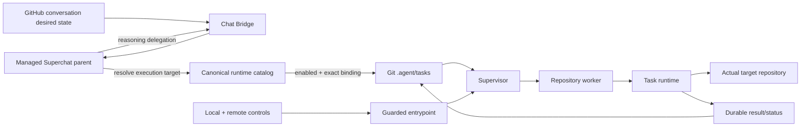

# Local Agent architecture

> **Design goal:** keep planning outside the executor and make local execution deterministic, target-bound, bounded, observable and recoverable.

Runtime truth comes from current `main`, the canonical runtime catalog, `AGENTS.md`, current operational documentation and live daemon evidence.

## System boundary


```mermaid
flowchart LR
    Parent["Managed Superchat parent"]
    Bridge["Chat Bridge"]
    Desired["GitHub conversation desired state"]
    Catalog["Canonical runtime catalog"]
    Tasks["Git .agent/tasks"]
    Entry["Guarded entrypoint"]
    Supervisor["Supervisor"]
    Worker["Repository worker"]
    Runtime["Task runtime"]
    Repo["Actual target repository"]
    Results["Durable result/status"]
    Operator["Local + remote controls"]

    Desired --> Bridge
    Bridge --> Parent
    Parent -->|reasoning delegation| Bridge
    Parent -->|resolve execution target| Catalog
    Catalog -->|enabled + exact binding| Tasks
    Tasks --> Supervisor
    Operator --> Entry
    Entry --> Supervisor
    Supervisor --> Worker
    Worker --> Runtime
    Runtime --> Repo
    Runtime --> Results
    Results --> Tasks
```

The parent chooses intent and owns the final execution decision. Chat Bridge owns browser transport and Conversation Fabric lifecycle. Local Agent independently owns repository authorization, hard binding, leases/resources, process lifecycle, watchdogs, checkpoints, publication and emergency controls.

## Transport is not execution authority

A managed ChatGPT conversation is transport/scheduling identity only. Conversation reasoning scope may span donor and target repositories without chat rebinding.

For every executable Local Agent task:

1. resolve the actual target through the canonical runtime catalog;
2. require a matching catalog record with `execution_enabled=true`;
3. require the exact canonical `agent_binding` to agree across catalog, registry/control identity and task payload;
4. acquire the normal repository/resource leases;
5. honor local/remote emergency controls.

Registry/control agreement without a canonical catalog record is not sufficient authority and fails closed.

The current catalog enables `local-agent`. Self-execution therefore uses the same ordinary target-bound rules as any other enabled repository; there is no permanent special-case self-execution bypass or prohibition.

## Root launchers and service lifecycle

Root Python files remain thin operational launchers only. Reusable implementation lives under `local_agent/`.

Important entrypoints:

- `agent_entrypoint.py` — guarded installed service lifecycle;
- `agent_parallel.py` — parallel multirepo supervisor;
- `agent_multirepo.py` — serial multirepo supervisor/fallback mode;
- `agentd.py` — compatibility operational launcher routed through `local_agent.daemon.launcher`.

The supported `agentd.py` path is registry-backed. If the machine repository registry is absent, it fails closed; it does **not** enter the legacy single-repository execution loop. Legacy daemon helpers remain implementation/recovery compatibility code, not an alternate authorization path.

## Package ownership

Key ownership boundaries:

| Area | Owner | Responsibility |
| --- | --- | --- |
| Canonical target/binding catalog | `local_agent/repository/binding.py` + catalog data | target identity, `execution_enabled`, canonical binding |
| Repository registry/context | `local_agent/repository/context.py` | machine provisioning/workspace paths/config digest/lease identities |
| Daemon launcher | `local_agent/daemon/launcher.py` | registry-backed operational `agentd.py` admission |
| Durable daemon state | `local_agent/daemon/service.py` | claims, durable result spool, run journal, self-update/control helpers |
| Serial repository worker | `local_agent/repository/worker.py` | one repository turn, final binding admission, repository controls |
| Parallel repository worker | `local_agent/supervisor/worker.py` | resource-aware admission, dedupe and task dispatch |
| Parallel supervisor | `local_agent/supervisor/orchestrator.py` | worker/process/control coordination |
| Serial supervisor | `local_agent/supervisor/serial.py` | serial multirepo fallback orchestration |
| Task contract | `local_agent/runtime/task_contract.py` | validation, binding/resources/dedupe metadata, limits and digest |
| Task runtime | `local_agent/runtime/executor.py` | command lifecycle, task budget, idle/RSS watchdogs, progress |
| Execution core | `local_agent/foundation/core.py` | workspace prepare/edit/verify/checkpoint/cleanup and publication |
| Process foundation | `local_agent/foundation/process.py` | registered process groups, bounded output, termination and lease FD inheritance |
| Emergency controls | `local_agent/operator/` | local disable and remote desired state |
| Chat Bridge worker composition | `chat_bridge/service_worker.js` + `worker_*.js` | browser transport/control/recovery routing |
| Fabric protocol/content | `chat_bridge/conversation_fabric_*.js` | delegate/collect envelope and parent content behavior |
| Fabric recovery/delivery | Fabric worker recovery + terminal-delivery guard modules | durable campaign recovery and terminal at-most-once semantics |

New implementation should live in its packaged owner rather than growing root compatibility shims.

## Task durability and replay safety

Task execution uses durable claims and final-result spooling. Interrupted claimed work is not silently replayed.

Parallel dedupe persists admitted/completed receipts. A crash can occur after the final result is durably published and the task claim is released but before the normal completion receipt write. Recovery therefore checks matching durable local `result_published` run evidence for the same task digest and promotes the admitted receipt to completed. Without matching durable publication evidence, corrective work remains retryable rather than being falsely marked complete.

This closes duplicate-execution replay without turning uncertain state into a false success.

## Serial vs parallel execution

Parallel multirepo execution is the production path and owns production queue coalescing/dedupe semantics. Serial mode remains a bounded fallback/diagnostic execution variant unless/until its parity contract is explicitly expanded.

Any future parity change must be stated in `OPERATIONS.md` and backed by a shared worker-path acceptance matrix rather than inferred from similarly named helpers.

## Process and timeout boundary

`local_agent/foundation/process.py` owns registered spawning, process-group termination, bounded output transfer and inherited repository/resource lease descriptors.

`local_agent/runtime/executor.py` owns command timeout, idle timeout, memory watchdogs and the task execution deadline used to decide whether another command can start while reserving finalization budget.

Workspace preparation, checkpointing and cleanup still have their own bounded operations. If `task_timeout` is ever promoted from execution-budget semantics to a strict total wall-clock contract, all preparation/finalization subprocess timeouts must be derived from the same remaining deadline and the documentation/tests must change together.

## Conversation Fabric

Production Conversation Fabric runs inside the operator's already authenticated primary Chrome session:

```text
managed parent
  -> LOCAL_AGENT_CF delegate
  -> service worker
  -> worker_spawn.js ownership transaction
  -> ordinary reasoning-only child tabs
  -> stable result capture
  -> durable campaign state
  -> exact owned-tab cleanup
  -> terminal parent feedback at most once
```

Children are reasoning-only. They do not create `.agent/tasks`, execute machine commands, mutate repositories or make the final parent decision.

### Durable campaign recovery

Campaigns and captured results are stored in `chrome.storage.local`.

After service-worker/session restart, a child tab may be reattached only when page evidence matches the exact transaction id, child-request digest, bootstrap digest and current child conversation URL. Tab id alone is never ownership proof. Ambiguous/pre-submit submission fails closed rather than replaying an already-submitted child bootstrap.

Stable child results require the explicit completion marker and repeated identical observation. Each stable result is saved before sibling completion or cleanup. Transient observation errors remain pending/recoverable.

The existing GitHub-control alarm normally reconciles remote conversation controls and then polls active Fabric campaigns while parent + Master are enabled. Explicit `collect` is a recovery/inspection operation for already-submitted children, not the normal polling loop and never permission to resubmit prompts.

### Terminal delivery journal

Ordinary Bridge wake delivery does not maintain a durable ambiguous-send journal; unconfirmed ordinary wake delivery remains diagnostic and is not speculatively replayed.

Conversation Fabric **terminal feedback is different**. It has a durable campaign-specific delivery claim written before crossing the parent Send boundary:

- definite no-send clears the claim;
- confirmed delivery marks the campaign delivered;
- an ambiguous claim surviving worker restart is treated as consumed and is not resent.

That rule provides durable terminal at-most-once semantics and intentionally trades possible terminal-notification liveness for replay safety.

A parent cannot start a different new delegation while an older terminal campaign still has undelivered feedback. This prevents stale cross-campaign terminal replay.

## GitHub desired state and pacing

GitHub `conversation_controls` is authoritative for managed-chat `STATUS`, `PAUSE`, `RESUME`, `NEXT` and `INTERVAL`. Every scheduling mutation increments `control_generation`. The global Bridge Master remains independent operator state and cannot be changed by per-conversation desired state.

Legacy LAB pacing/binding controls remain migration/diagnostic compatibility only.

## Direct GitHub edits vs Local Agent

Use direct GitHub edits when the desired repository/source/docs diff is exact and CI is sufficient verification. Use Local Agent for work that genuinely requires machine-local commands, local builds/tests, devices, services or host state.

This choice does not alter target authorization: any Local Agent task must still pass canonical catalog admission and exact target binding.

## Safety invariants

Refactoring or cleanup must not weaken these properties:

- canonical catalog admission is mandatory before worker execution;
- `execution_enabled=false` fails closed;
- exact catalog/registry/control/task binding agreement is required;
- local disable state wins over task admission;
- repository/resource leases prevent conflicting execution;
- interrupted claimed task work is not silently replayed;
- durable result publication may be retried without rerunning commands;
- parallel dedupe recovery suppresses duplicate equivalent work after proven final-result publication;
- command output/time/RSS are bounded;
- dirty workspace state is checkpointed before destructive cleanup;
- child reasoning cannot obtain machine authority;
- Fabric restart recovery cannot adopt a child from tab id alone;
- terminal Fabric feedback is durably at-most-once;
- stale terminal campaigns cannot replay after a newer delegation becomes authoritative.

## Verification architecture

Primary verification entrypoint:

```bash
python scripts/verify.py
```

CI additionally covers branch-aware coverage, Python 3.14, macOS smoke and real-extension browser smoke. Runtime/Bridge changes require focused regressions plus full exact-head CI before merge.

Browser lifecycle/recovery changes should be proven through production routing where feasible: parent content → worker event routing → child spawn/observation → durable campaign state → terminal delivery → restart/reload reconciliation → no duplicate delivery.

See also:

- [`GOLDEN_STANDARD.md`](GOLDEN_STANDARD.md)
- [`AUTONOMOUS_CHAT_LOOP.md`](AUTONOMOUS_CHAT_LOOP.md)
- [`GITHUB_BRIDGE_CONTROL.md`](GITHUB_BRIDGE_CONTROL.md)
- [`HOST_OPS_MULTIREPO.md`](HOST_OPS_MULTIREPO.md)
- [`OPERATIONS.md`](OPERATIONS.md)
- [`../chat_bridge/README.md`](../chat_bridge/README.md)
