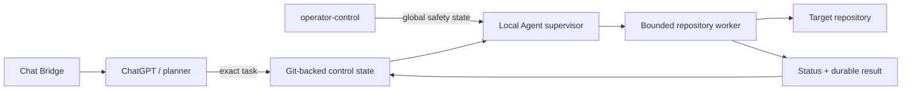

# Local Agent documentation

> **Start here when you need the right document quickly.** This directory separates current operational contracts from historical design records and release notes.

## Choose your path

| Goal | Read this |
| --- | --- |
| Operate or recover Local Agent | [`OPERATIONS.md`](OPERATIONS.md) |
| Understand repository scheduling | [`MULTI_REPOSITORY.md`](MULTI_REPOSITORY.md) |
| Understand current production invariants | [`GOLDEN_STANDARD.md`](GOLDEN_STANDARD.md) |
| Use the ChatGPT / Chat Bridge autonomous loop | [`AUTONOMOUS_CHAT_LOOP.md`](AUTONOMOUS_CHAT_LOOP.md) |
| Stop, cancel or recover autonomous execution | [`EMERGENCY_CONTROLS.md`](EMERGENCY_CONTROLS.md) |
| Recreate the established macOS environment | [`SESSION_BOOTSTRAP.md`](SESSION_BOOTSTRAP.md) |
| Review release history | [`CHANGELOG.md`](CHANGELOG.md) |

## System map

The planner decides **what** should change. Local Agent owns deterministic, bounded and observable execution of that exact task. Repository identity, resource admission and emergency controls remain executor-side safety contracts.

## Current operational documentation

### Runtime and operations

- [`OPERATIONS.md`](OPERATIONS.md) — queues, task resources, deployment, rollback and recovery.
- [`MULTI_REPOSITORY.md`](MULTI_REPOSITORY.md) — repository registry, workers and scheduling model.
- [`GOLDEN_STANDARD.md`](GOLDEN_STANDARD.md) — current production invariants and accepted operating model.
- [`EMERGENCY_CONTROLS.md`](EMERGENCY_CONTROLS.md) — cancellation, disable state and recovery controls.

### Planner and bridge

- [`AUTONOMOUS_CHAT_LOOP.md`](AUTONOMOUS_CHAT_LOOP.md) — planner/executor loop and continuation rules.
- [`../chat_bridge/README.md`](../chat_bridge/README.md) — extension installation, hard binding and conversation controls.

### Development and verification

- [`../AGENTS.md`](../AGENTS.md) — repository ownership rules, safety invariants and release requirements.
- [`TEST_EXECUTION_GOLDEN_PLAN.md`](TEST_EXECUTION_GOLDEN_PLAN.md) — verification design and execution evidence.
- [`PARALLEL_EXECUTION_PLAN.md`](PARALLEL_EXECUTION_PLAN.md) — historical design/audit record for bounded parallel execution; current resource policy is defined by the operational docs above.

## Releases

- [`CHANGELOG.md`](CHANGELOG.md) — concise operational release history.
- `RELEASE_NOTES_V*.md` — detailed notes retained for releases that have dedicated records.
- Git tag `vX.Y.Z` plus `agent_version.RELEASE_VERSION` are the release-version source of truth.

## Historical material

Files under [`history/`](history/) are intentionally non-canonical. They are useful for design context, but current behavior must be verified against `main`, the operational docs above and live daemon evidence.

> [!IMPORTANT]
> When documentation disagrees with runtime evidence, do not infer compatibility or silently repair state. Follow the fail-closed rules in `AGENTS.md` and the current operational documentation.
