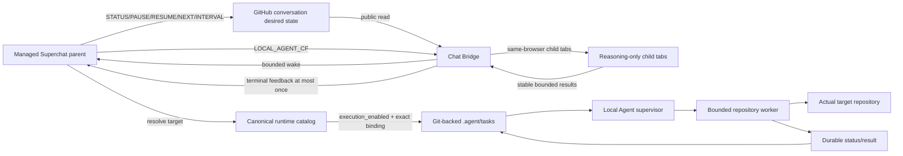

# Local Agent documentation

> **Start here for the current contract.** Current operational docs are separated from historical release/design evidence.

## Choose your path

| Goal | Read this |
| --- | --- |
| Operate or recover Local Agent | [`OPERATIONS.md`](OPERATIONS.md) |
| Understand module boundaries | [`ARCHITECTURE.md`](ARCHITECTURE.md) |
| Understand security boundaries | [`SECURITY_MODEL.md`](SECURITY_MODEL.md) |
| Understand repository scheduling | [`MULTI_REPOSITORY.md`](MULTI_REPOSITORY.md) |
| Understand current release/runtime invariants | [`GOLDEN_STANDARD.md`](GOLDEN_STANDARD.md) |
| Continue current development | [`DEVELOPMENT_PLAN.md`](DEVELOPMENT_PLAN.md) |
| Resume from the current handoff | [`CURRENT_HANDOFF.md`](CURRENT_HANDOFF.md) |
| Run the Superchat planner loop | [`AUTONOMOUS_CHAT_LOOP.md`](AUTONOMOUS_CHAT_LOOP.md) |
| Control managed-chat pacing/status through GitHub | [`GITHUB_BRIDGE_CONTROL.md`](GITHUB_BRIDGE_CONTROL.md) |
| Understand Host Ops and multirepo authority | [`HOST_OPS_MULTIREPO.md`](HOST_OPS_MULTIREPO.md) |
| Understand remaining ChatGPT DOM dependencies | [`CHATGPT_DOM_CONTRACT.md`](CHATGPT_DOM_CONTRACT.md) |
| Stop/cancel/recover execution | [`EMERGENCY_CONTROLS.md`](EMERGENCY_CONTROLS.md) |
| Recreate the established macOS environment | [`SESSION_BOOTSTRAP.md`](SESSION_BOOTSTRAP.md) |
| Contribute code safely | [`../CONTRIBUTING.md`](../CONTRIBUTING.md) |
| Review release history | [`CHANGELOG.md`](CHANGELOG.md) |

## System map

```mermaid
flowchart LR
    Parent["Managed Superchat parent"]
    Desired["GitHub conversation desired state"]
    Bridge["Chat Bridge"]
    Children["Reasoning-only child tabs"]
    Catalog["Canonical runtime catalog"]
    Tasks["Git-backed .agent/tasks"]
    Supervisor["Local Agent supervisor"]
    Worker["Bounded repository worker"]
    Repo["Actual target repository"]
    Result["Durable status/result"]

    Parent -->|STATUS/PAUSE/RESUME/NEXT/INTERVAL| Desired
    Desired -->|public read| Bridge
    Bridge -->|bounded wake| Parent
    Parent -->|LOCAL_AGENT_CF| Bridge
    Bridge -->|same-browser child tabs| Children
    Children -->|stable bounded results| Bridge
    Bridge -->|terminal feedback at most once| Parent
    Parent -->|resolve target| Catalog
    Catalog -->|execution_enabled + exact binding| Tasks
    Tasks --> Supervisor
    Supervisor --> Worker
    Worker --> Repo
    Worker --> Result
    Result --> Tasks
```

The parent planner decides **what** should change. GitHub is the durable conversation control/evidence plane. Chat Bridge owns bounded browser transport and reasoning-child lifecycle. Local Agent owns deterministic machine execution. Chat identity and reasoning scope never grant repository execution authority.

For executable work, the actual target must exist in the canonical runtime catalog, have `execution_enabled=true`, and use the exact canonical `agent_binding`. The current catalog enables `local-agent`; self-execution follows the same normal admission/lease/resource/emergency-control rules as every other enabled target.

Conversation Fabric campaign/results are durable in `chrome.storage.local`. The normal GitHub-control alarm observes active campaigns. Explicit `collect` is recovery/inspection for already-submitted children, not normal polling and never prompt replay. Terminal feedback has durable at-most-once semantics across worker restart.

## Current operational documentation

### Runtime and operations

- [`OPERATIONS.md`](OPERATIONS.md) — queues, resources, deployment, rollback and recovery.
- [`ARCHITECTURE.md`](ARCHITECTURE.md) — package ownership and dependency direction.
- [`SECURITY_MODEL.md`](SECURITY_MODEL.md) — trust boundaries and enforced safety properties.
- [`MULTI_REPOSITORY.md`](MULTI_REPOSITORY.md) — registry, workers and scheduling.
- [`GOLDEN_STANDARD.md`](GOLDEN_STANDARD.md) — accepted release/runtime invariants.
- [`DEVELOPMENT_PLAN.md`](DEVELOPMENT_PLAN.md) — active forward work only.
- [`CURRENT_HANDOFF.md`](CURRENT_HANDOFF.md) — concise current continuation state.
- [`EMERGENCY_CONTROLS.md`](EMERGENCY_CONTROLS.md) — cancellation, disable state and recovery.

### Planner and Bridge

- [`AUTONOMOUS_CHAT_LOOP.md`](AUTONOMOUS_CHAT_LOOP.md) — current parent planner/executor continuation loop.
- [`GITHUB_BRIDGE_CONTROL.md`](GITHUB_BRIDGE_CONTROL.md) — canonical GitHub-backed conversation pacing/status + Fabric recovery interaction.
- [`HOST_OPS_MULTIREPO.md`](HOST_OPS_MULTIREPO.md) — multirepo reasoning and target-execution authority boundaries.
- [`CHATGPT_DOM_CONTRACT.md`](CHATGPT_DOM_CONTRACT.md) — browser DOM compatibility boundary.
- [`../chat_bridge/README.md`](../chat_bridge/README.md) — current extension architecture and Conversation Fabric lifecycle.
- [`conversation_fabric/README.md`](conversation_fabric/README.md) — Conversation Fabric surface and supporting evidence.

### Development and verification

- [`../CONTRIBUTING.md`](../CONTRIBUTING.md) — setup and verification workflow.
- [`../AGENTS.md`](../AGENTS.md) — repository ownership, safety and release requirements.
- [`BUG_BACKLOG.md`](BUG_BACKLOG.md) — confirmed defects and required regressions.
- [`TEST_EXECUTION_GOLDEN_PLAN.md`](TEST_EXECUTION_GOLDEN_PLAN.md) — verification design/evidence.

## Direct GitHub edits vs Local Agent

Use direct GitHub edits when the intended repository/source/docs diff is exact and repository CI is sufficient verification. Use Local Agent for tasks that genuinely require machine-local commands, local builds/tests, devices, services or host state. Conversation Fabric children never perform repository or machine mutations; the parent owns those decisions and actions.

## Release and audit evidence

- [`CHANGELOG.md`](CHANGELOG.md) — release history/index.
- `RELEASE_NOTES_V*.md` — release-specific historical evidence retained for rollback/audit work.
- dated audit/checkpoint files — historical evidence for the state they describe, not the current control contract.
- Git tag `vX.Y.Z` plus `local_agent.version.RELEASE_VERSION` — immutable release-line anchors; current `main`/deployed `self_revision` are read separately.

## Historical material

Files under [`history/`](history/), old release notes and dated Conversation Fabric checkpoints are non-canonical evidence. Current behavior must be verified against `main`, the operational docs above and live runtime evidence.

> [!IMPORTANT]
> When documentation disagrees with current source/runtime evidence, do not infer compatibility or silently repair state. Follow the fail-closed rules in `AGENTS.md`, the canonical runtime catalog and the current operational documentation.
