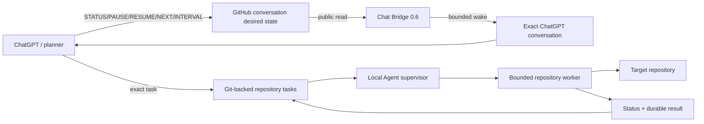

# Local Agent documentation

> **Start here when you need the current contract quickly.** Current operational docs are separated from historical release/design evidence.

## Choose your path

| Goal | Read this |
| --- | --- |
| Operate or recover Local Agent | [`OPERATIONS.md`](OPERATIONS.md) |
| Understand module boundaries | [`ARCHITECTURE.md`](ARCHITECTURE.md) |
| Understand security boundaries | [`SECURITY_MODEL.md`](SECURITY_MODEL.md) |
| Understand repository scheduling | [`MULTI_REPOSITORY.md`](MULTI_REPOSITORY.md) |
| Understand current release/runtime invariants | [`GOLDEN_STANDARD.md`](GOLDEN_STANDARD.md) |
| Run the ChatGPT autonomous loop | [`AUTONOMOUS_CHAT_LOOP.md`](AUTONOMOUS_CHAT_LOOP.md) |
| Control Chat Bridge pacing/status through GitHub | [`GITHUB_BRIDGE_CONTROL.md`](GITHUB_BRIDGE_CONTROL.md) |
| Use the host-ops multirepo workspace | [`HOST_OPS_MULTIREPO.md`](HOST_OPS_MULTIREPO.md) |
| Understand remaining ChatGPT DOM dependencies | [`CHATGPT_DOM_CONTRACT.md`](CHATGPT_DOM_CONTRACT.md) |
| Stop/cancel/recover execution | [`EMERGENCY_CONTROLS.md`](EMERGENCY_CONTROLS.md) |
| Recreate the established macOS environment | [`SESSION_BOOTSTRAP.md`](SESSION_BOOTSTRAP.md) |
| Contribute code safely | [`../CONTRIBUTING.md`](../CONTRIBUTING.md) |
| Review release history | [`CHANGELOG.md`](CHANGELOG.md) |

## System map

```mermaid
flowchart LR
    Planner["ChatGPT / planner"]
    Desired["GitHub conversation desired state"]
    Bridge["Chat Bridge 0.6"]
    Chat["Exact ChatGPT conversation"]
    Tasks["Git-backed repository tasks"]
    Supervisor["Local Agent supervisor"]
    Worker["Bounded repository worker"]
    Repo["Target repository"]
    Result["Status + durable result"]

    Planner -->|STATUS/PAUSE/RESUME/NEXT/INTERVAL| Desired
    Desired -->|public read| Bridge
    Bridge -->|bounded wake| Chat
    Chat --> Planner
    Planner -->|exact task| Tasks
    Tasks --> Supervisor
    Supervisor --> Worker
    Worker --> Repo
    Worker --> Result
    Result --> Tasks
```

The planner decides **what** should change. GitHub is the durable control surface. Chat Bridge owns bounded browser wake delivery. Local Agent owns deterministic execution. Repository identity, resource admission and emergency controls remain executor-side safety contracts.

For a GitHub-managed conversation, the ChatGPT DOM is not the source of truth for pacing/status.

## Current operational documentation

### Runtime and operations

- [`OPERATIONS.md`](OPERATIONS.md) — queues, resources, deployment, rollback and recovery.
- [`ARCHITECTURE.md`](ARCHITECTURE.md) — package ownership and dependency direction.
- [`SECURITY_MODEL.md`](SECURITY_MODEL.md) — trust boundaries and enforced safety properties.
- [`MULTI_REPOSITORY.md`](MULTI_REPOSITORY.md) — registry, workers and scheduling.
- [`GOLDEN_STANDARD.md`](GOLDEN_STANDARD.md) — accepted release/runtime invariants.
- [`EMERGENCY_CONTROLS.md`](EMERGENCY_CONTROLS.md) — cancellation, disable state and recovery.

### Planner and Bridge

- [`AUTONOMOUS_CHAT_LOOP.md`](AUTONOMOUS_CHAT_LOOP.md) — current planner/executor continuation loop.
- [`GITHUB_BRIDGE_CONTROL.md`](GITHUB_BRIDGE_CONTROL.md) — canonical GitHub-backed conversation pacing/status contract.
- [`HOST_OPS_MULTIREPO.md`](HOST_OPS_MULTIREPO.md) — explicit `host-ops` multirepo authorization and target-binding rules.
- [`CHATGPT_DOM_CONTRACT.md`](CHATGPT_DOM_CONTRACT.md) — remaining browser DOM compatibility boundary.
- [`../chat_bridge/README.md`](../chat_bridge/README.md) — extension architecture, installation and migration surfaces.

### Development and verification

- [`../CONTRIBUTING.md`](../CONTRIBUTING.md) — setup and verification workflow.
- [`../AGENTS.md`](../AGENTS.md) — repository ownership, safety and release requirements.
- [`BUG_BACKLOG.md`](BUG_BACKLOG.md) — confirmed defects and required regressions.
- [`TEST_EXECUTION_GOLDEN_PLAN.md`](TEST_EXECUTION_GOLDEN_PLAN.md) — verification design/evidence.

## Releases and handoffs

- [`CHANGELOG.md`](CHANGELOG.md) — current release history/index.
- `RELEASE_NOTES_V*.md` — release-specific evidence.
- `CHAT_BRIDGE_HANDOFF_*.md` — time-bounded field/audit handoffs; the newest handoff is the starting point for a fresh-context Bridge audit, not a replacement for canonical docs.
- Git tag `vX.Y.Z` plus `local_agent.version.RELEASE_VERSION` are the release-version source of truth.

## Historical material

Files under [`history/`](history/) and old dated handoffs/release notes are non-canonical evidence. Current behavior must be verified against `main`, the operational docs above and live runtime evidence.

The frozen v4.18.13 checkpoint remains available at [`PRODUCTION_BASELINE_V4.18.13.md`](PRODUCTION_BASELINE_V4.18.13.md) for that specific rollback/audit purpose.

> [!IMPORTANT]
> When documentation disagrees with runtime evidence, do not infer compatibility or silently repair state. Follow the fail-closed rules in `AGENTS.md` and the current operational documentation.
