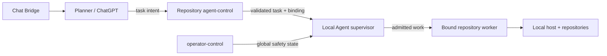

# Security model

Local Agent is **execution infrastructure**, not a security sandbox. It is designed to make AI-assisted local execution explicit, bounded, attributable and recoverable. It does not make arbitrary commands safe and it does not attempt to isolate an intentionally malicious task from the host account that runs the agent.

> [!WARNING]
> Treat a task accepted by Local Agent as code execution with the permissions of the Local Agent operating-system user. Do not expose the task/control channels to principals you would not trust with that level of access.

## Trust boundaries

The important boundaries are:

1. **Planner → control state** — planner intent becomes immutable task data. Local Agent does not infer repository identity from natural-language context.
2. **Control state → executor** — schema, digest, repository identity, hard binding and resource admission are checked before execution.
3. **Supervisor → worker** — repository work runs in short-lived isolated worker processes with process-group tracking and inherited execution/resource leases.
4. **Operator control → all work** — repository-independent emergency disable has precedence over normal task admission.

## What Local Agent protects

### Repository identity

One executable repository has one canonical opaque `agent_binding` UUID. Before claim/execution, the executor requires agreement between the machine-local registry, `.agent/binding.json` and the task binding. Missing or mismatched binding fails closed before task commands execute.

Chat Bridge conversation binding is not inferred from model context. Changing repository identity is an explicit operator **Rebind** operation.

### Task identity and replay

- task payloads have immutable digests;
- a task id cannot silently acquire a different payload inside one repository;
- malformed task data becomes terminal evidence instead of an implicit retry;
- an interrupted claimed task is never silently replayed;
- terminal result publication is recoverable independently from command execution.

These rules reduce accidental duplicate execution and make recovery auditable.

### Bounded execution

Runtime commands use bounded output transport, process groups and command/no-output/whole-task/RSS controls. Repository and external-resource leases prevent conflicting work from being admitted concurrently and survive worker failure through spawned descendants.

These are **reliability and containment bounds**, not an operating-system sandbox.

### Git publication

Publication stages exact paths rather than using broad `git add -A`. Repository control clones are infrastructure state, and normal work is queued through the repository `agent-control` branch rather than by editing daemon-owned control clones manually.

### Emergency control

The global disable path is independent of project repositories. The guarded entrypoint observes the central `operator-control` branch and persists a local disabled marker. A remote request can disable the agent, but remote state cannot clear the local marker; re-enable is an explicit local action.

Repository-scoped `cancel_task` requires the exact task id. Runtime reset is allowed only while disabled and removes only local ephemeral runtime state.

See [`EMERGENCY_CONTROLS.md`](EMERGENCY_CONTROLS.md).

## What Local Agent does not protect against

Local Agent currently does **not** claim to provide:

- a VM/container/macOS sandbox for task commands;
- filesystem isolation from everything accessible to the Local Agent user;
- network egress isolation;
- secret redaction from arbitrary command output;
- protection against a deliberately malicious task authored by a trusted control-plane principal;
- multi-tenant hostile-code isolation.

If any of these become requirements, they should be added as explicit executor-side mechanisms rather than inferred from the existing watchdog and worker model.

## Fail-closed rules

The executor intentionally refuses or terminally rejects work when identity or task-contract evidence is invalid. Important examples include:

- missing repository binding;
- mismatched registry/control/task binding;
- malformed task JSON;
- invalid resource declarations;
- changed repository configuration between scheduling and dispatch;
- malformed persistent disable state.

Unexpected checkout state is not automatically overwritten. Self-update must validate before restart and roll back on validation failure.

## Operator checklist

Before enabling autonomous execution:

- verify the running daemon revision/status rather than relying only on the checkout;
- keep repository bindings and the local registry intentional and unique;
- keep `operator-control` available as an independent stop path;
- do not share control-plane write access with untrusted principals;
- treat credentials available to the Local Agent OS user as potentially available to executed tasks;
- use named resources for exclusive hardware and `machine` only for true whole-host exclusivity;
- preserve the release verification gates in [`../AGENTS.md`](../AGENTS.md).

## Security changes

A change to binding, task validation, process lifecycle, emergency controls, Git publication, resource locking, self-update or command execution is security-relevant even when it is not branded as a security feature. Such changes require targeted regression coverage plus the broader release checks described in [`../AGENTS.md`](../AGENTS.md).

> [!IMPORTANT]
> When a safety property matters, encode it in the executor and test it. Planner instructions and documentation are supporting controls, not enforcement boundaries.
